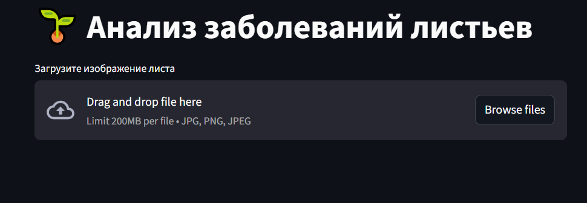
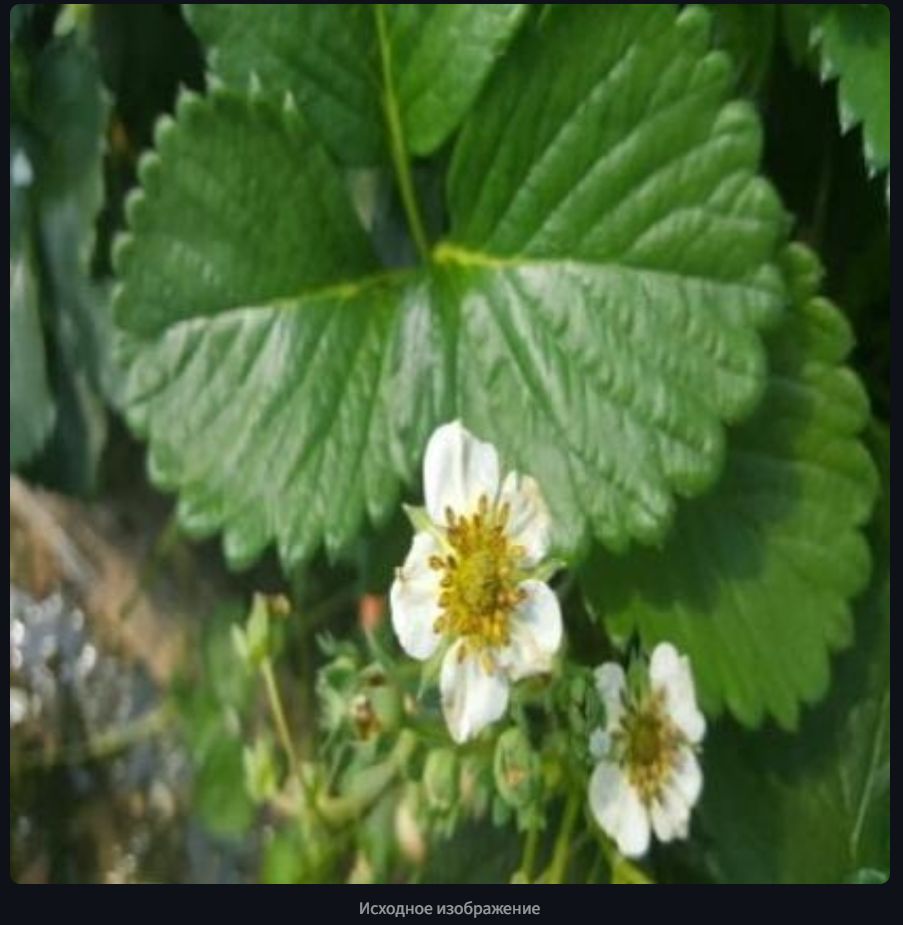
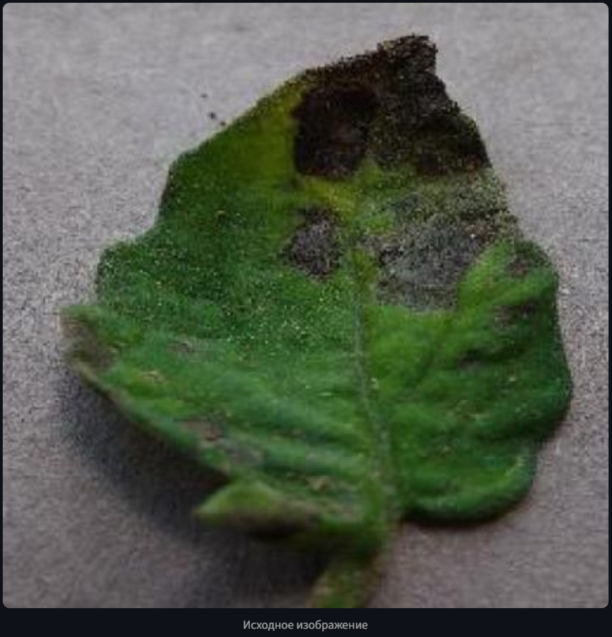
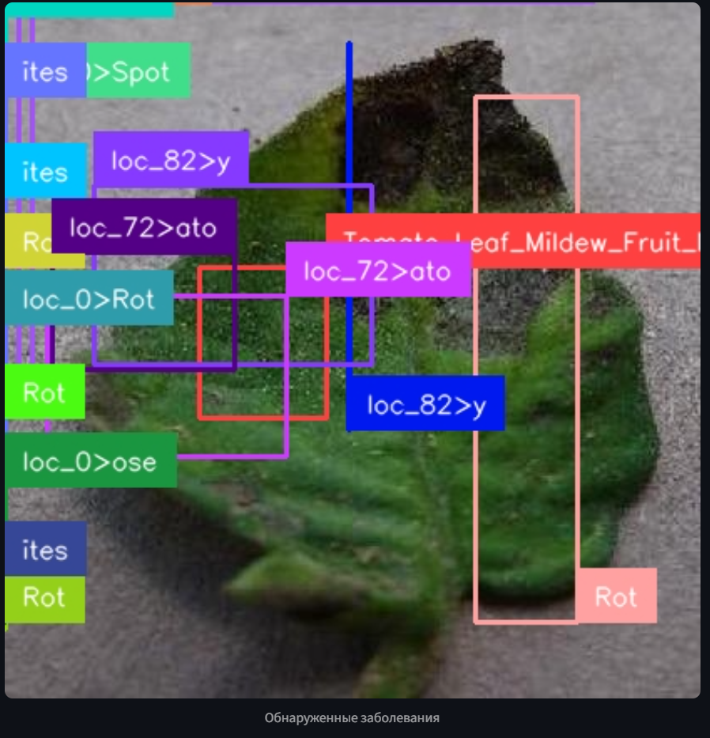
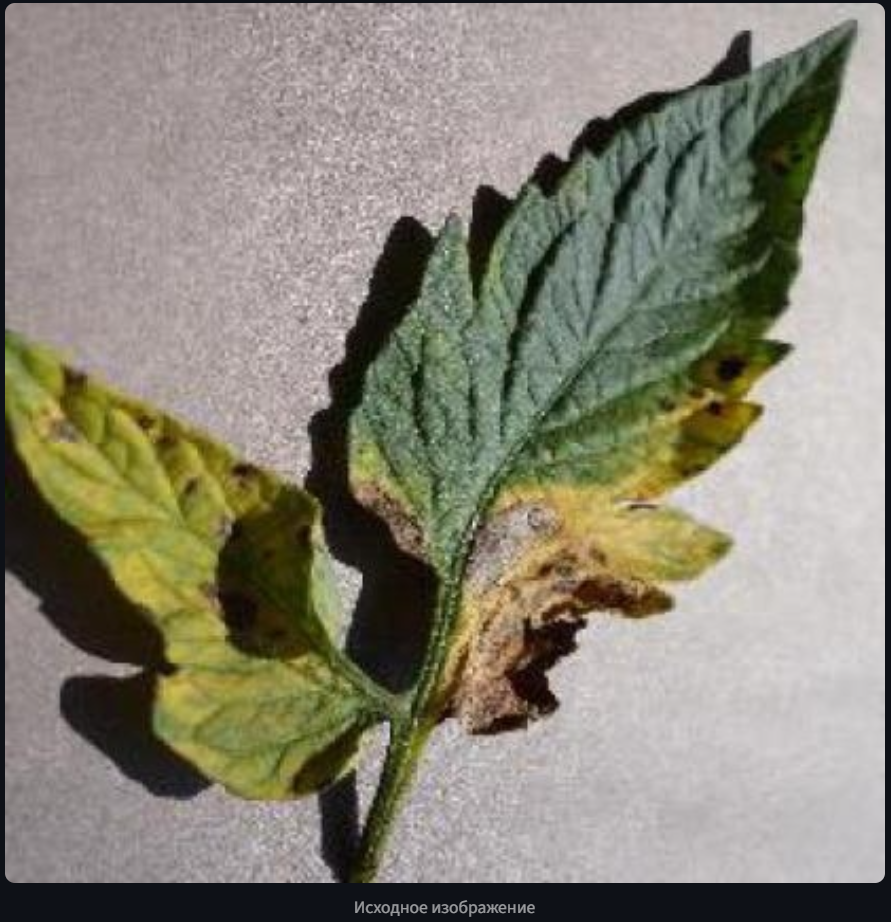

# plantato
*Мой пет-проект для выявления заболеваний растений!*

Мое кучерявое солнышко!

# Постановка задачи:

С момента как я завел себе комнатное растение меня не отпускает мысль об автоматизации ухода за ним. Один из важнейших аспектов заботы о растении - своевременное выявление заболеваний. Заболевания, в свою очередь, выражаются внешними признаками - гниль на листьях, белые пятна на стволе и ветвях, почернение, слизь. Вовремя заметив больной листик можно предотвратить распространение заразы, которая, к слову, может перекинуться на другие растения! Было бы здорово приделать лазер или домашний огнемет и выжигать проблемные ветви пока зараза не распространилась по всему растению, но без должного прицеливания - есть риск задеть здоровые побеги... Тут мне и пришла идея адаптировать Florence-2 (всем известно что Flora - это что то связанное с растительностью, а значит по умолчанию подходит) для ~~наведения автополива~~ автотурели!

# Цель:

__Дообучить модель для определения заболеваний растений по фотографии их листьев или плодов и сделать простой интерфейс для тестирования__

# План реализации

1. Взять за основу Florence-2-base-ft так как сделать к ней LoRA адаптер на моем домашнем ПК будет вполне посильно!
2. Подобрать датасет на ROBOFLOW для задачи детекции заболеваний растений и загрузить его в формате Florence-2 object detection.
3. ~~Своровать у индуса~~ Написать код обучения адаптера!
4. ~~Навайбкодить~~  Реализовать веб интерфейс (чтобы показать ребятам в школе) используя streamlit.
5. Протестировать получившееся чудо с целью вычисления рисков спалить квартиру!!!

# Что из этого вышло?
    _Код для файнтюна валяется под именем fLoRAnce_2_FT.ipynb

Для запуска интерфейса рекомендую склонировать проект на WSL2 и в окружении выполнить команду на запуск ```streamlit run /path/app.py```

Открываем localhost ```http://localhost:8501```



Здесь Вам предлагается отправить фото листика растения для оценки его нашей дообученной моделью. Попробуем!



Потрясающе, жмем "Анализировать"! Вот что выдает нам модель:


***Ву-а-ля! Непревзойденная точность! Нет проблем - нет найденных объектов!***

Попробуем еще разок?)

Новая картинка, тут явно беды с бошкой!




Результат анализа:



***И снова потрясающий результат! Теперь модель обнаружила кучу объектов ведь тут куча проблемных мест!***

Ну и на сладкое!



Я не знаю что это за растение, пока слаб в ботанике, но модель говорит что все с ним хорошо, а так как она дважды уже попала в цель - то и тут сомневаться не приходится!


# А теперь серьезно:


## Мой конфиг:
| | |
|-|-|
|OS|WSL 2 (ubuntu)|
|CPU|XEON w-5 3425 (12 ядер, 24 потока)|
|GPU|RTX A4000 (16 гб VRAM)|
|RAM|DDR5 128 Gb|

## Датасет:

1. Как я понял - Florence ужимает картинки до 768 на 768 пикселей, так что надо хотя бы прикинуть будет ли что то видно на Ваших изображениях. 
2. Есть формат JSONL for Florence object detection, но мои эксперименты показали что он и Voc ест нормально (см ноутбук с обучением).
3. Картинок надо много, видеопамяти тоже.

## LoRA адаптер:

1. Обучал для следующих слоев: "q_proj", "o_proj", "k_proj", "v_proj", "linear", "Conv2d", "lm_head", "fc2". Пробовал по советам в интернете сократить до "q_proj" и "k_proj", но мне это хоть и значительно смократило потребление памяти - не позволило достичь результат.
2. Dropout ставил 0.05 - так неплохо идет.
3. LR - 5e-6 и далее scheduler отрегулирует. Первые эпохи обучение идет бодро, потом приходится крохи выбирать.

## Результаты:

_Благодаря дообучению florence стала хорошо решать задачу детекции заболеваний растений!_


1. Streamlit - Простой и читаемый интерфейс за минуту.
2. Модель хорошо различает плесень и гниль и иногда даже называет по изображению листа растение которому он принадлежит.
3. Модель посредственно справляется с расстановкой границ проблемных областей. Тестирование по метрике iou (см. ноутбук с обучением, раздел "Тестирование") показало прирост в качестве модели после дообучения (0.054 балла против 0.006 изначальных) - тем не менее, этого недостаточно. 

## Полезные ссылки:
1. Статья про дообучение модели: https://datascientistsdiary.com/fine-tuning-florence-2/
2. Датасет: https://universe.roboflow.com/artificial-intelligence-82oex/detecting-diseases/dataset/6/download
3. Оригинальная модель Florence 2: https://huggingface.co/microsoft/Florence-2-base
